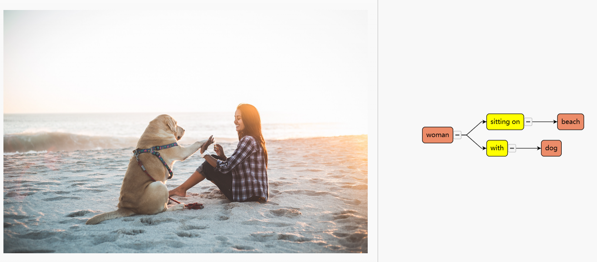
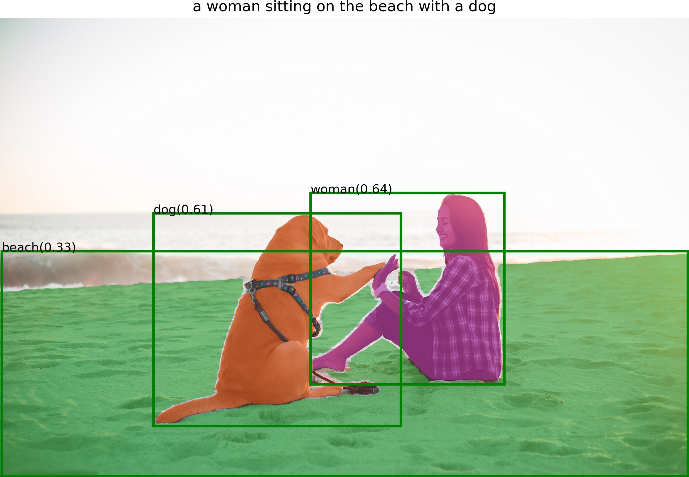

# Scene Graph Generate:


This project is still under development.Please look forward to it...

Install Segment Anything:

```bash
python -m pip install -e segment_anything
```

Install Grounding DINO:

```bash
python -m pip install -e GroundingDINO
```


Install diffusers:

```bash
pip install --upgrade diffusers[torch]
```


The following optional dependencies are necessary for mask post-processing, saving masks in COCO format, the example notebooks, and exporting the model in ONNX format. `jupyter` is also required to run the example notebooks.
```
pip install opencv-python pycocotools matplotlib onnxruntime onnx ipykernel
```

More details can be found in [install segment anything](https://github.com/facebookresearch/segment-anything#installation) and [install GroundingDINO](https://github.com/IDEA-Research/GroundingDINO#install)

- Download the checkpoint for Segment Anything and Grounding Dino:
```bash
cd Grounded-Segment-Anything

wget https://dl.fbaipublicfiles.com/segment_anything/sam_vit_h_4b8939.pth
wget https://github.com/IDEA-Research/GroundingDINO/releases/download/v0.1.0-alpha/groundingdino_swint_ogc.pth
```


## :running_man: Run Scene Graph Generate Demo

- Run Demo
```bash
export CUDA_VISIBLE_DEVICES=0
python scene_graph_gen.py \
  --config GroundingDINO/groundingdino/config/GroundingDINO_SwinT_OGC.py \
  --grounded_checkpoint groundingdino_swint_ogc.pth \
  --sam_checkpoint sam_vit_h_4b8939.pth \ 
  --input_image assets/demo.jpg \
  --output_dir "outputs" \
  --box_threshold 0.25 \
  --text_threshold 0.2 \
  --iou_threshold 0.5  \
  --device "cpu"
```
then,remove the file "./outputs/scenegraph.json" to "./SGDraw" 
- Run Visualization
```bash
cd SGDraw
python -m http.server
```
Open in browser "localhost:8000"

open "Object-Oriented_SG_Drawing.html" file

click on the button "Load JSON" and choose the file "scenegraph.json"


by the way,the object detection result at "./outputs"



## :cupid: Acknowledgements
- [Segment Anything](https://github.com/facebookresearch/segment-anything)
- [Grounding DINO](https://github.com/IDEA-Research/GroundingDINO)
- [Grounded-Segment-Anything](https://github.com/IDEA-Research/Grounded-Segment-Anything)
- [SceneGraphParser](https://github.com/vacancy/SceneGraphParser)
- [LAVIS](https://github.com/salesforce/LAVIS)
- [SGDraw](https://github.com/zty0304/SGDraw)
